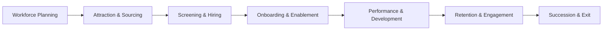
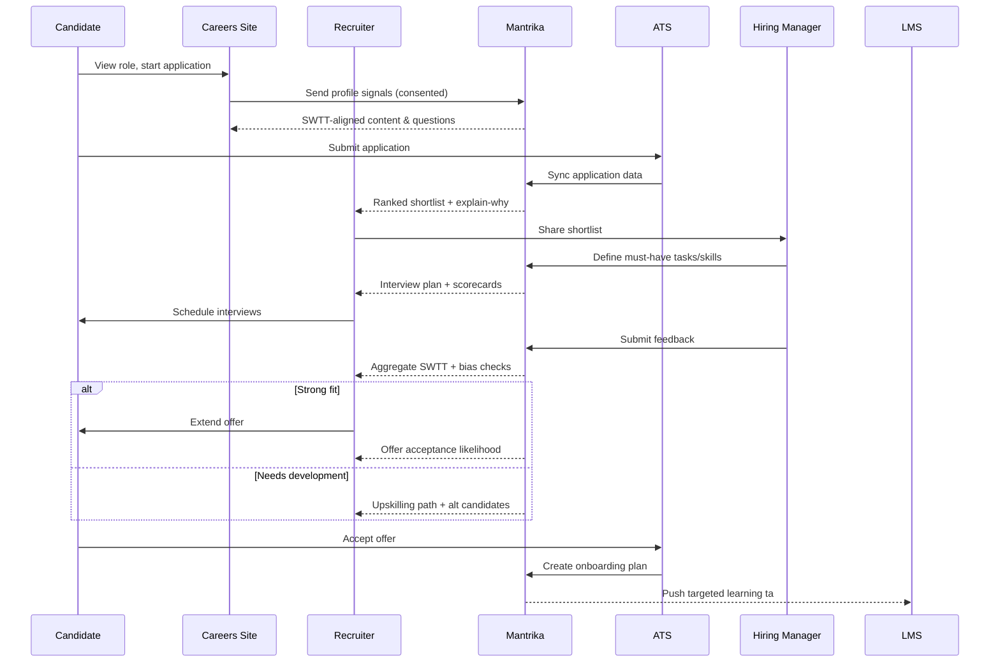

```mermaid
flowchart LR
  A[Workforce Planning] --> B[Attraction & Sourcing]
  B --> C[Screening & Hiring]
  C --> D[Onboarding & Enablement]
  D --> E[Performance & Development]
  E --> F[Retention & Engagement]
  F --> G[Succession & Exit]
```

```mermaid
sequenceDiagram
  participant CA as Candidate
  participant CS as Careers Site
  participant RE as Recruiter
  participant MA as Mantrika
  participant AT as ATS
  participant HM as Hiring Manager
  participant LM as LMS

  CA->>CS: View role, start application
  CS->>MA: Send profile signals (consented)
  MA-->>CS: SWTT-aligned content & questions

  CA->>AT: Submit application
  AT->>MA: Sync application data
  MA-->>RE: Ranked shortlist + explain-why

  RE->>HM: Share shortlist
  HM->>MA: Define must-have tasks/skills
  MA-->>RE: Interview plan + scorecards

  RE->>CA: Schedule interviews
  HM->>MA: Submit feedback
  MA-->>RE: Aggregate SWTT + bias checks

  alt Strong fit
    RE->>CA: Extend offer
    MA-->>RE: Offer acceptance likelihood
  else Needs development
    MA-->>RE: Upskilling path + alt candidates
  end

  CA->>AT: Accept offer
  AT->>MA: Create onboarding plan
  MA-->>LM: Push targeted learning ta


```
