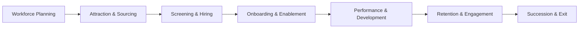

```mermaid
flowchart TB
  %% Subgraphs: use plain titles, no [Title] syntax
  subgraph Existing_HR_Stack
    HRIS[HRIS: Workday/SAP/Oracle]
    ATS[ATS: Greenhouse/Lever]
    LMS[LMS: Docebo/Cornerstone]
    BI[BI: PowerBI/Tableau]
  end

  subgraph Mantrika_Layer
    SWTT[SWTT Engine (Skill Will Task Time)]
    AGENTS[Agent Bus: RecruitEdge, PerformX, ProfitOptima]
    ETHICS[Explainability + Bias Audit + ROI Dashboard]
  end

  subgraph Data_Sources
    SKILLS[Resumes and Skills DB]
    PROJECTS[Jira, Git, Task Logs]
    FEEDBACK[Surveys and 360 Feedback]
    HRDATA[Org Hierarchy, Payroll, KPIs]
  end

  %% Edges (avoid subgraph-to-subgraph links)
  SKILLS --> SWTT
  PROJECTS --> SWTT
  FEEDBACK --> SWTT
  HRDATA --> SWTT

  HRIS --> SWTT
  SWTT --> HRIS

  AGENTS --> BI
  Mantrika_Layer --> HRIS


```
