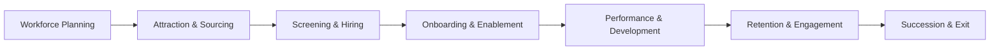

```mermaid
flowchart TB
  subgraph HR_Systems [Existing HR Stack]
    HRIS[(Workday / SAP / Oracle HCM)]
    ATS[(Greenhouse / Lever)]
    LMS[(Docebo / Cornerstone)]
    BI[(PowerBI / Tableau)]
  end

  subgraph Mantrika_AI [Mantrika.ai Layer]
    SWTT[SWTT Engine (Skill–Will–Task–Time)]
    Agents[Agent Bus: RecruitEdge, PerformX, ProfitOptima]
    Ethics[Explainability + Bias Audit + ROI Dashboard]
  end

  subgraph Data_Sources [Input Data]
    Skills[Resumes / Skills DB]
    Projects[Jira / Git / Task Logs]
    Feedback[Surveys / 360 Feedback]
    HRData[Org Hierarchy / Payroll / KPIs]
  end

  Data_Sources --> SWTT
  HR_Systems --> Mantrika_AI
  Mantrika_AI --> HR_Systems
  Mantrika_AI --> BI

```
