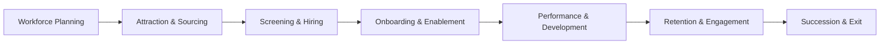

```mermaid
flowchart TB
  subgraph HR_Stack [Existing HR Stack]
    HRIS[HRIS (Workday / SAP / Oracle)]
    ATS[ATS (Greenhouse / Lever)]
    LMS[LMS (Docebo / Cornerstone)]
    BI[BI (PowerBI / Tableau)]
  end

  subgraph Mantrika [Mantrika.ai Layer]
    SWTT[SWTT Engine (Skill-Will-Task-Time)]
    Agents[Agent Bus: RecruitEdge, PerformX, ProfitOptima]
    Ethics[Explainability + Bias Audit + ROI Dashboard]
  end

  subgraph Sources [Input Data]
    Skills[Resumes and Skills DB]
    Projects[Jira, Git, Task Logs]
    Feedback[Surveys and 360 Feedback]
    HRData[Org Hierarchy, Payroll, KPIs]
  end

  Sources --> SWTT
  HR_Stack --> Mantrika
  Mantrika --> HR_Stack
  Mantrika --> BI

```
