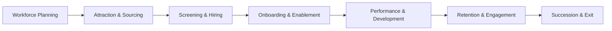
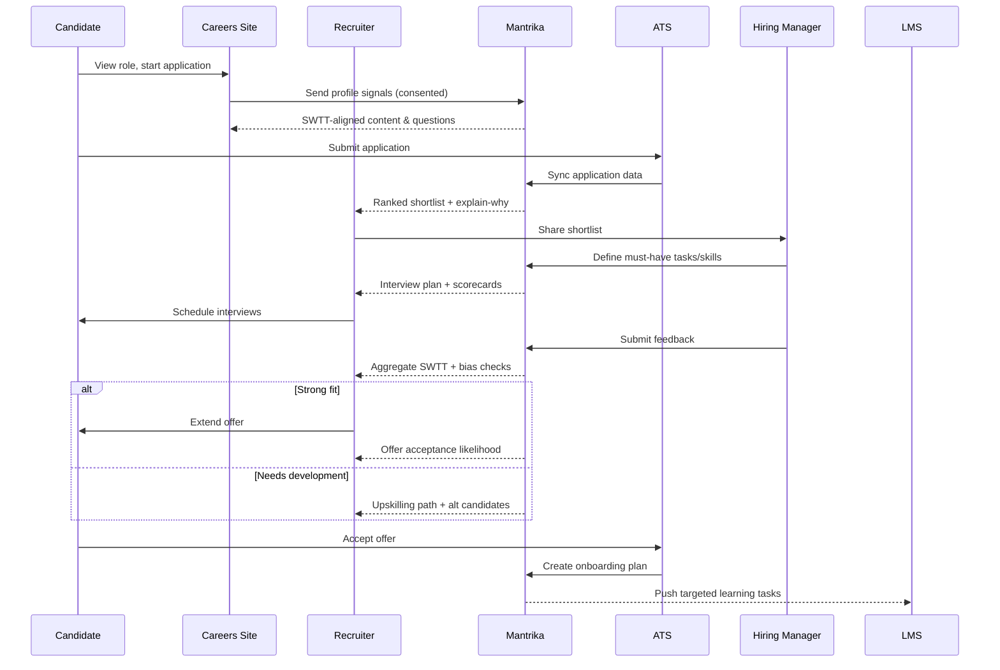
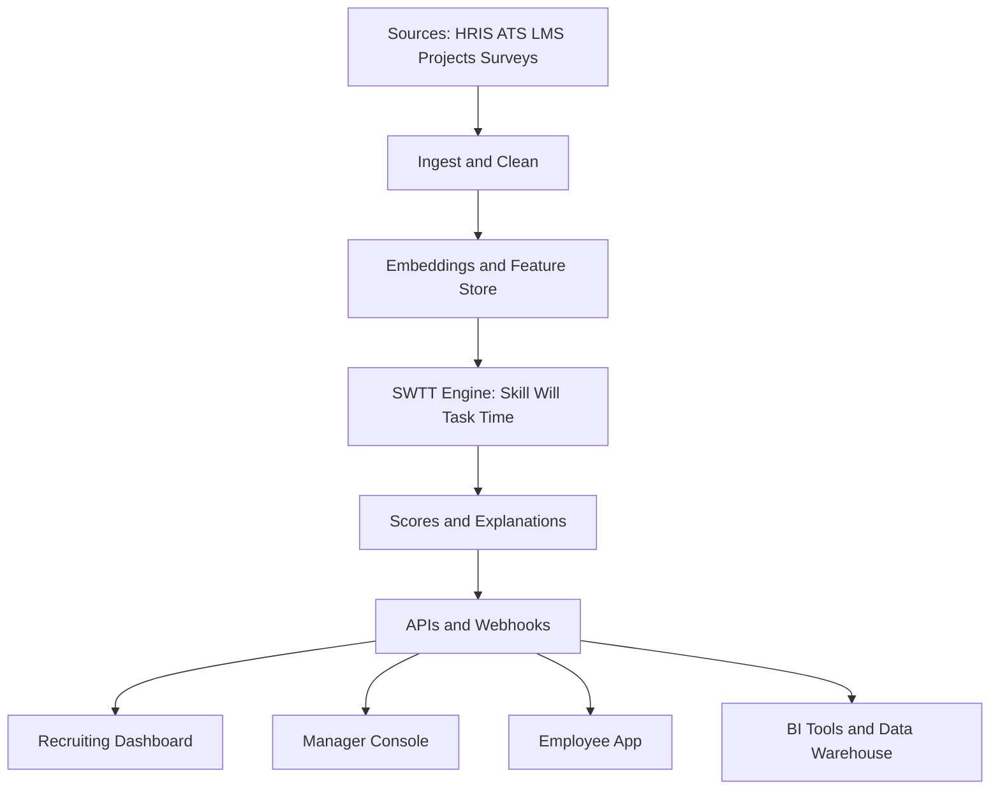
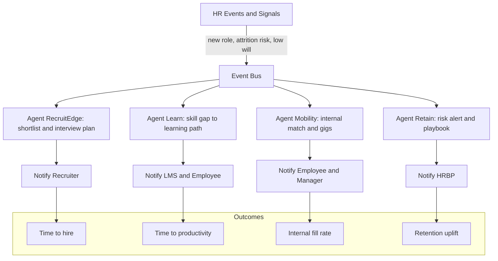
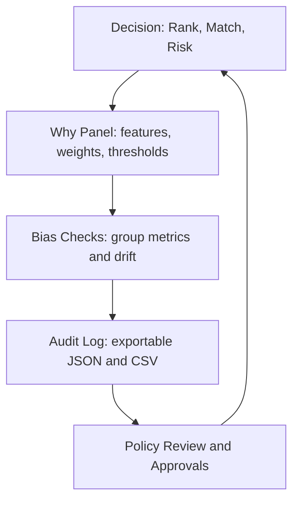
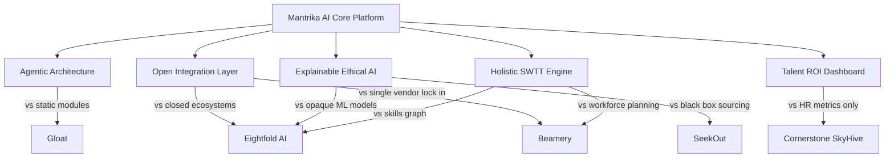

```mermaid
flowchart LR
  A[Workforce Planning] --> B[Attraction & Sourcing]
  B --> C[Screening & Hiring]
  C --> D[Onboarding & Enablement]
  D --> E[Performance & Development]
  E --> F[Retention & Engagement]
  F --> G[Succession & Exit]
```
Hiring journey with Mantrika (sequence)

```mermaid
sequenceDiagram
  participant CA as Candidate
  participant CS as Careers Site
  participant RE as Recruiter
  participant MA as Mantrika
  participant AT as ATS
  participant HM as Hiring Manager
  participant LM as LMS

  CA->>CS: View role, start application
  CS->>MA: Send profile signals (consented)
  MA-->>CS: SWTT-aligned content & questions

  CA->>AT: Submit application
  AT->>MA: Sync application data
  MA-->>RE: Ranked shortlist + explain-why

  RE->>HM: Share shortlist
  HM->>MA: Define must-have tasks/skills
  MA-->>RE: Interview plan + scorecards

  RE->>CA: Schedule interviews
  HM->>MA: Submit feedback
  MA-->>RE: Aggregate SWTT + bias checks

  alt Strong fit
    RE->>CA: Extend offer
    MA-->>RE: Offer acceptance likelihood
  else Needs development
    MA-->>RE: Upskilling path + alt candidates
  end

  CA->>AT: Accept offer
  AT->>MA: Create onboarding plan
  MA-->>LM: Push targeted learning tasks


```
SWTT dataflow and surfaces (flowchart)

```mermaid
flowchart TD
  A[Sources: HRIS ATS LMS Projects Surveys] --> B[Ingest and Clean]
  B --> C[Embeddings and Feature Store]
  C --> D[SWTT Engine: Skill Will Task Time]
  D --> E[Scores and Explanations]
  E --> F[APIs and Webhooks]
  F --> G[Recruiting Dashboard]
  F --> H[Manager Console]
  F --> I[Employee App]
  F --> J[BI Tools and Data Warehouse]

```
Event-driven interventions (who does what, when)

```mermaid
flowchart TD
  EV[HR Events and Signals] -->|new role, attrition risk, low will| BUS[Event Bus]
  BUS --> AG1[Agent RecruitEdge: shortlist and interview plan]
  BUS --> AG2[Agent Mobility: internal match and gigs]
  BUS --> AG3[Agent Retain: risk alert and playbook]
  BUS --> AG4[Agent Learn: skill gap to learning path]

  AG1 --> AC1[Notify Recruiter]
  AG2 --> AC2[Notify Employee and Manager]
  AG3 --> AC3[Notify HRBP]
  AG4 --> AC4[Notify LMS and Employee]

  subgraph Outcomes
    OC1[Time to hire]
    OC2[Time to productivity]
    OC3[Internal fill rate]
    OC4[Retention uplift]
  end

  AC1 --> OC1
  AC2 --> OC3
  AC3 --> OC4
  AC4 --> OC2
```
Governance and explainability loop

```mermaid
flowchart TD
  X[Decision: Rank, Match, Risk] --> Y[Why Panel: features, weights, thresholds]
  Y --> Z[Bias Checks: group metrics and drift]
  Z --> AA[Audit Log: exportable JSON and CSV]
  AA --> AB[Policy Review and Approvals]
  AB --> X
```

```mermaid
graph TD
    %% Competitors
    E[Eightfold AI]
    B[Beamery]
    G[Gloat]
    S[SeekOut]
    C[Cornerstone SkyHive]

    %% Core (Mantrika)
    M[Mantrika AI Core Platform]

    %% Differentiators
    D1[Holistic SWTT Engine]
    D2[Agentic Architecture]
    D3[Explainable Ethical AI]
    D4[Talent ROI Dashboard]
    D5[Open Integration Layer]

    %% Connections
    M --> D1
    M --> D2
    M --> D3
    M --> D4
    M --> D5

    %% Comparison lines
    D1 -->|vs skills graph| E
    D1 -->|vs workforce planning| B
    D2 -->|vs static modules| G
    D3 -->|vs opaque ML models| E
    D3 -->|vs black box sourcing| S
    D4 -->|vs HR metrics only| C
    D5 -->|vs closed ecosystems| E
    D5 -->|vs single vendor lock in| B


```
